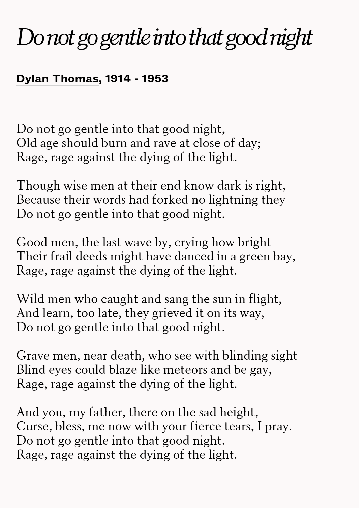

《星际穿越》是我最喜欢的科幻电影，也是唯一一部靠知识密度把我感动哭了的电影。也许看它的时候沉迷在了物理学知识里，所以并没有注意到里面反复出现的“Do not go gentle into that good night.”这句吟唱。虽然后来一个前同事经常提起它，但我也一直没有体会到它的美。一直到我今天完整的读到了这首诗。

这首诗有很多的译本，看了几个都觉得并没有原版的韵味，甚至曲解了一些意思。也可能，它们并没有曲解它，曲解它的实际是我。不过这并不重要，重要的是我们自己的想法、自己的感触，诗人们只是给我们提供了一个生活的视角。诗意是他们想要表达的东西，而不是他们想要传达的东西。我们读诗自然也不全是为了理解他们的诗意，我还可以通过它们，发现那些潜藏在自己生活里的诗意。

Do not go gentle into that good night.
在我们有生之前，我们处于无尽的黑暗之中。
在我们有生之后，我们亦可能处于无尽的黑暗之中。
我们短暂的一生，犹如黑夜里闯入明室的夜莺。
我们从一扇窗进来，从另一扇窗出去，此间充满了光明。
Rage, rage against the dying of the light.
光明将逝，我们理当声嘶力竭，奋力一搏。
不要温和地走进那个良夜。
黑夜恒长，光明一瞬。降生之起，我们就走向消亡。
我们要畏惧黑夜的来临，
我们要悲恸光明的流逝，
我们要燃尽这一生的光芒。
因为它只此一次，
此后黑夜长存。
